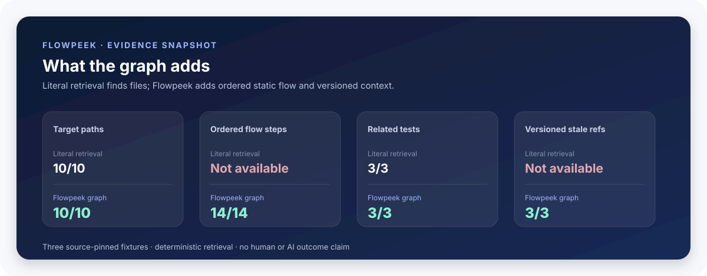
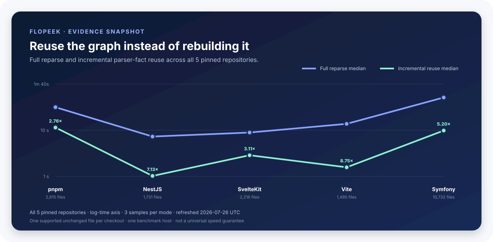

# Flowpeek evidence

This page answers one question: **what has Flowpeek actually demonstrated?**

Every result is bounded by its dataset, revision, host, and evidence class. Raw JSON is linked next to the claim it supports.

## At a glance

| Question | Checked answer | Read it as |
| --- | ---: | --- |
| Are declared static relationships recovered? | **92/92** | Exact result for 14 manually audited scopes in 5 pinned repositories |
| Is parser reuse faster than full reparse? | **1.67×–54.53×** | Four host-specific repository samples; not a universal promise |
| Does Flowpeek add context beyond literal retrieval? | **14/14 ordered steps; 3/3 stale refs** | Three small source-pinned fixtures; no productivity claim |
| Can the package install from its exact tarball? | **Passed** | One private Windows/Node clean-room observation; no publish approval |
| Does a framework command adapter work beyond a fixture? | **47 declarations** | One pinned Django source snapshot; static declaration evidence only |

Machine-readable entry point: [`benchmarks/public-proof.json`](benchmarks/public-proof.json).

```powershell
flowpeek proof D:\path\to\repository --iterations 3
flowpeek proof D:\path\to\repository --iterations 3 --format json
```

The Viewer exposes the same contract through **Why Flowpeek**. MCP exposes it through `get_product_proof`. Read-only proof retrieval does not start a benchmark; a local timing run is always explicit.

## Audited relationship slice

The external corpus pins pnpm, NestJS, SvelteKit, Vite, and Symfony. Fourteen source scopes declare their expected outgoing static relationships.

| Run | Repositories | Scopes | Expected | TP | FP | FN | Precision | Recall |
| --- | ---: | ---: | ---: | ---: | ---: | ---: | ---: | ---: |
| 2026-07-14 | 5 | 14 | 92 | 92 | 0 | 0 | 100% | 100% |

Raw manifest: [`benchmarks/real-repository-corpus.json`](benchmarks/real-repository-corpus.json).

Fresh declared-host reproduction: [`production-static-evidence.json`](benchmarks/production-static-evidence.json) records the complete 5/5 corpus run at the current dirty development baseline.

```powershell
node src/real-repository-corpus.js --clone-directory D:\benchmarks\flowpeek-real-corpus --format json
```

**Boundary:** 92/92 describes only the declared relationships in those 14 scopes. It is not accuracy for every edge, file, language construct, or runtime path in the repositories.

## Django command declaration slice

Flowpeek scanned [Django 5.2.5](https://github.com/django/django/tree/5.2.5) at pinned revision `a3b1107a4955bdd994908efb4c6e1d03c281e69f`: **2,864** scanned files, **47** supported narrow management-command declarations, and **24** application-scope Framework Command Flow Lenses. The checked command-to-class relation passed.

Raw evidence: [`framework-entry-production-evidence.json`](benchmarks/framework-entry-production-evidence.json).

The same Django snapshot was re-scanned at the current dirty development baseline; the reproduced 2,864 files, 47 supported declarations, 24 Flow Lenses, and checked relation are recorded in [`production-static-evidence.json`](benchmarks/production-static-evidence.json).

**Boundary:** this validates only Flowpeek's narrow static `management/commands` declaration subset. It does not prove Django app registration, settings loading, command discovery at runtime, invocation, `handle()` execution, or application behavior.

## Repository orientation

The orientation suite compares two deterministic tools:

- **Literal retrieval:** case-insensitive substring matches over repository text.
- **Flowpeek:** static graph lookup, Flow Lens, test relationships, and versioned Context Refs.

Benchmark oracle files such as `expectations.json` are explicitly excluded from literal retrieval and disclosed in each raw report.



| Metric | Literal retrieval | Flowpeek |
| --- | ---: | ---: |
| Correct targets | 10/10 | 10/10 |
| Ordered static steps | unavailable | 14/14 |
| Directly related tests | 3/3 | 3/3 |
| Versioned stale refs | unavailable | 3/3 |
| Bounded context files | 13 | 13 |
| Estimated context tokens | 508 | 1,158 |
| Repository preparation | 71.435 ms | 1,103.443 ms |
| Three case retrievals | 0.777 ms | 15.676 ms |
| Separate stale-ref probe | unavailable | 2,413.364 ms |

Raw runs: [`orientation-baseline.json`](benchmarks/orientation-baseline.json), [`orientation-flowpeek.json`](benchmarks/orientation-flowpeek.json), and [`orientation-cases.json`](benchmarks/orientation-cases.json).

```powershell
flowpeek evaluate orientation . --cases benchmarks/orientation-cases.json
```

### Interpretation

- Literal retrieval is faster and smaller when exact identifiers are already supplied.
- Flowpeek pays a cold graph-build cost for ordered relationships and reusable versioned context.
- The stale-ref probe is separate: it copies a fixture, scans a baseline, changes source, refreshes, and resolves the older ref.
- Token values use the disclosed four-characters-per-token estimator. They are not provider tokenizer measurements.
- Timing is one Windows/Node 24.18.0 observation and is non-gating.

This suite does not measure developer time, agent patch quality, runtime correctness, business understanding, or end-to-end token savings. See the [orientation protocol](docs/orientation-benchmark-protocol.md).

## Incremental parser reuse



| Repository | Revision | Source / parsed files | Full median | Incremental median | Speedup |
| --- | --- | ---: | ---: | ---: | ---: |
| [SvelteKit](https://github.com/sveltejs/kit) | `14d7d5a` | 2,216 / 2,214 | 3,992.24 ms | 947.48 ms | 4.21× |
| [pnpm](https://github.com/pnpm/pnpm) | `0a68c77` | 2,615 / 1,568 | 11,485.87 ms | 6,865.61 ms | 1.67× |
| [NestJS](https://github.com/nestjs/nest) | `f293848` | 1,731 / 1,727 | 6,675.51 ms | 3,952.46 ms | 1.69× |
| [Symfony](https://github.com/symfony/symfony) | `7dbebd8` | 10,730 / 10,726 | 47,270.13 ms | 866.87 ms | 54.53× |

Each row contains three full and incremental samples for one supported unchanged source file. Incremental mode reuses parser facts, then rebuilds global relationships. Selected paths and raw samples come from:

```powershell
flowpeek benchmark D:\path\to\repository --iterations 3 --format json
```

**Boundary:** this measures local CPU time on one machine. It does not prove watcher latency, every change shape, every language adapter, or universal speedup. The pnpm checkout also parsed 1,043 Rust files and produced 1,091 static module-import edges; that is scale evidence, not Rust relationship accuracy.

## Clean-room package

The verifier packs the exact npm tarball, audits its allowlist, installs it into an empty temporary consumer with lifecycle scripts disabled, and checks:

- installed package identity and CLI;
- help, doctor, and one `--no-cache` static scan;
- MCP startup and required context tools;
- unchanged non-cache fixture fingerprint;
- cleanup and no publication attempt.

```powershell
npm run test:package
npm run audit:package
npm run verify:clean-room
```

Checked observation: [`packaging/evidence/clean-room-current.json`](packaging/evidence/clean-room-current.json). Protocol: [`docs/clean-room-package.md`](docs/clean-room-package.md).

**Boundary:** the package has prepared public beta metadata but its standard publish path remains blocked until an exact owner approval record is changed. This does not establish licensing, registry availability, release stage, upgrade compatibility, or support for every operating system.

## Private dogfooding

| Observation | Result | Read it as |
| --- | ---: | --- |
| Completed anonymous targets | **5** | Parser coverage and graph scale only |
| Largest completed static scan | **3,805 files / 7,743 nodes** | One 52.95 s host observation |
| Endpoint-free targets | **4** | Technical maps retained; Flow Lenses correctly withheld |
| Broad workspace budget | **60 s exceeded** | A scale limit to address, not an accuracy failure |

Raw aggregate only: [`private-dogfood-summary.json`](benchmarks/private-dogfood-summary.json). Protocol: [`docs/private-dogfooding.md`](docs/private-dogfooding.md).

The run did not execute target applications, tests, configuration, or runtime integrations and retained no machine paths or source bodies. `--no-cache` is regression-tested to create neither graph cache nor project-identity metadata. A zero Flow Lens catalog means no supported static HTTP/request endpoint was extracted; it does not mean that the target has no behavior.

## Supported-language product journey

The pinned product cohort exercises one bounded static Flow Lens through
semantic levels, MCP Context Ref retrieval, a disposable source-only refresh,
and stale-context resolution for three declared subsets.

| Static subset | Audited relationships | Flow steps | Domain / Feature / Component / Symbol | MCP Context Ref | Source-only refresh |
| --- | ---: | ---: | ---: | --- | --- |
| TypeScript HTTP | 7/7 | 5 | 1 / 1 / 1 / 9 | resolved | `v1 → v2`, stale |
| Python decorator HTTP | 4/4 | 5 | 1 / 1 / 1 / 7 | resolved | `v1 → v2`, stale |
| PHP package-command + direct function | 2/2 | 4 | 1 / 1 / 2 / 1 | resolved | `v1 → v2`, stale |

Raw case definitions and source digests: [`supported-language-dogfood-cases.json`](benchmarks/supported-language-dogfood-cases.json). Checked outcome: [`supported-language-dogfood.json`](benchmarks/supported-language-dogfood.json).

```powershell
npm run evaluate:language-dogfood
```

**Boundary:** every source edit occurs in a disposable copy. This demonstrates
only the listed static subsets, semantic projection availability, MCP Context
Ref basis, and stale lifecycle. It does not execute the target applications,
tests, package scripts, PHP runtime, or HTTP server; it is not a universal
language-support score or release approval.

## Evaluation contracts that are not product outcomes

| Contract | Command | Current meaning |
| --- | --- | --- |
| Paired agent comparison | `npm run evaluate:agent-comparison` | Harness validated; checked provider cohort remains `not-run` |
| Deterministic semantic suggestions | `npm run evaluate:semantic` | 2 candidates + 2 required abstentions match the fixture contract |
| Feedback aggregation | `npm run evaluate:feedback` | Synthetic storage/reporting metrics only |
| Private reviewed cohort | `npm run evaluate:reviewed-feedback -- --dataset <file> --require-gate` | Requires consented held-out data; template cannot pass |
| Handoff retrieval | `npm run evaluate:handoff-quality` | Bounded retrieval, budget, traceability, and stale-ref gate |

These contracts never become parser truth. A provider answer, human observation, runtime record, test event, and static graph fact retain separate evidence classes.

## What evidence is still missing?

- Paired real-provider tasks with and without Flowpeek.
- Consented developer orientation studies on unfamiliar repositories.
- Patch correctness, regression, and end-to-end token outcomes.
- Large-repository warm-query and watcher-latency distributions.
- Cross-platform clean-room results beyond completed CI/host observations.
- Large-workspace initial-scan budget and workspace-level discovery behavior.

Until those datasets exist, Flowpeek should be evaluated as a promising evidence-oriented context tool—not as proven universal SDLC acceleration.
