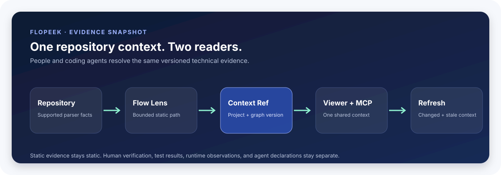
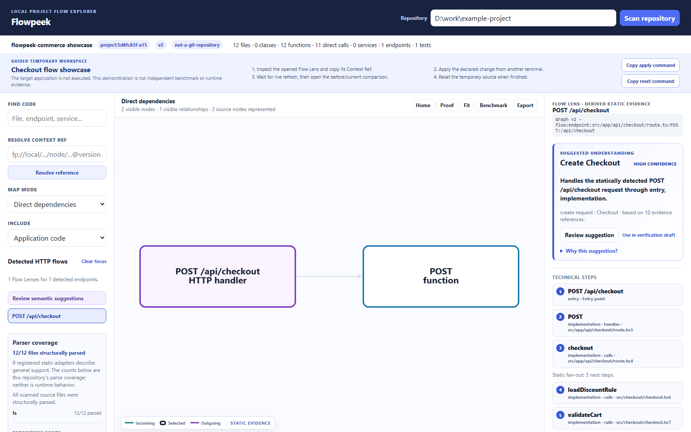
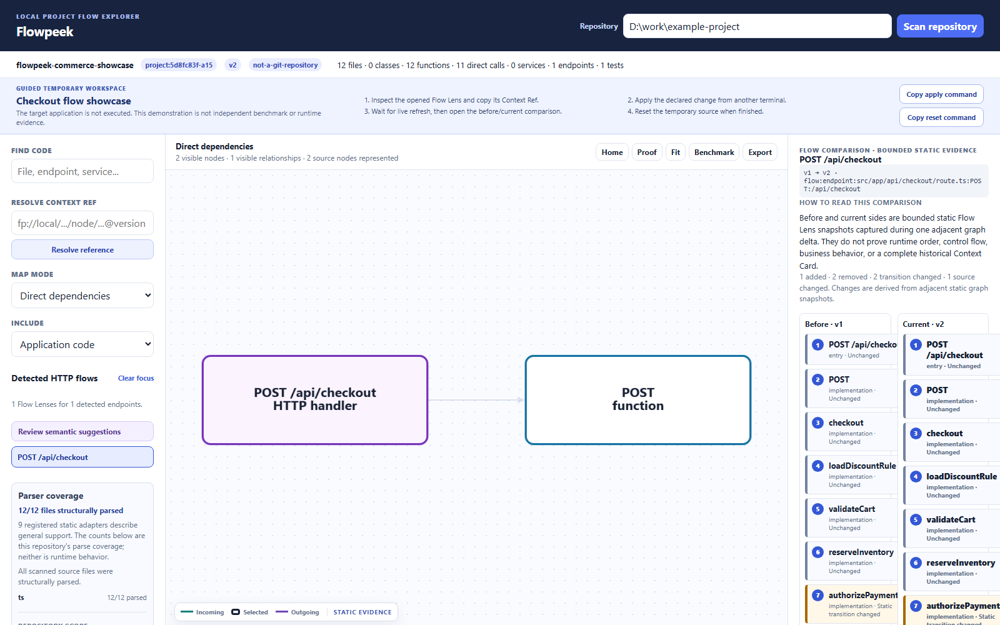
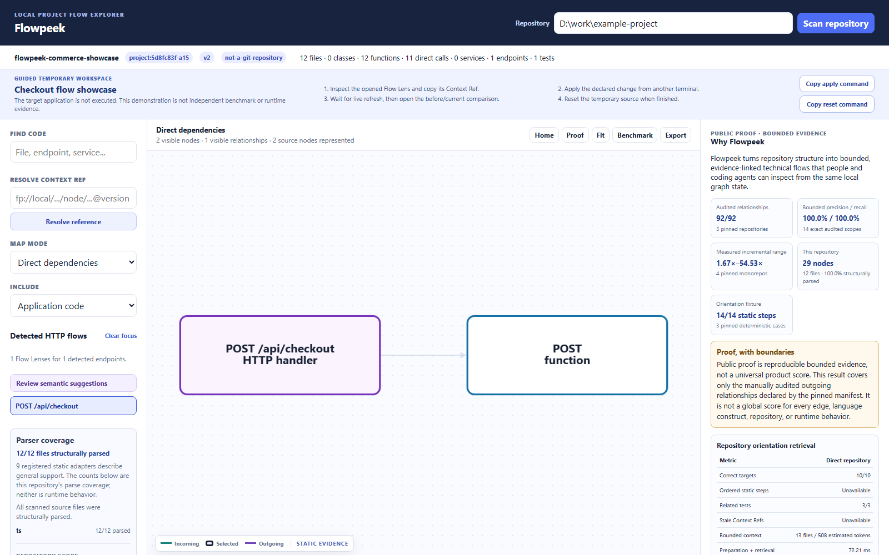

# Flowpeek

> See the technical flow before you edit the code.

Flowpeek turns an existing repository into a focused, versioned technical map. Open it in a lightweight local Viewer or give the same context to a coding agent through MCP.

- **Local-first:** source stays on your machine.
- **AI-optional:** parsing and graph generation are deterministic.
- **Agent-ready:** Viewer, HTTP, and MCP resolve the same graph version.
- **Evidence-aware:** static flow, tests, human notes, agent declarations, and runtime observations stay separate.



## Try the full experience

Flowpeek is not published to npm yet. Run the current source checkout:

```powershell
git clone https://github.com/badsleepyday/flowpeek.git
cd flowpeek
npm install
npm run showcase
```

The showcase opens a safe temporary checkout flow. It does not execute the target application or change the committed example.



Follow one live change:

1. Copy the **apply** command shown by the Viewer.
2. Run it in another terminal.
3. Open the new **before/current** comparison.
4. Resolve the earlier Context Ref and see it marked stale.

[Open the five-minute walkthrough](docs/showcase-walkthrough.md)

## What you get

| You need to… | Flowpeek gives you… |
| --- | --- |
| Enter an unfamiliar repository | Entry points, focused technical flows, boundaries, and source links |
| Review a change | Affected contexts, before/current static flow, impact, and related tests |
| Hand work to another developer | A compact Context Ref or Context Packet tied to a graph version |
| Ground a coding agent | Bounded MCP context with parser coverage, evidence limits, and stale detection |
| Track local delivery context | Evidence-linked Work records, planned windows, workflow state, and append-only actual events |
| Keep a large repository readable | Domain → Feature → Component → Symbol navigation, focus mode, scoped layers, search, and server-side projection |

### Human view

The local Viewer stays intentionally small. It provides a Project Home, bounded
semantic zoom, Flow Lens, direct dependencies, live change tray, Context Cards,
proof reports, a read-only local Work ledger, and a focused source inspector—not
another IDE or project tracker. Semantic summary nodes are derived from static
source facts; they are not files, runtime services, or execution steps.



### Agent view

An agent starts with `get_agent_bootstrap`, resolves a flow or node, reads only the source it needs with its normal workspace tools, refreshes Flowpeek after edits, and checks changed or stale context.

```text
get_agent_bootstrap
  → get_scan_status
  → get_entry_flows
  → get_flow_projection
  → get_related_tests
  → edit with existing workspace tools
  → refresh_graph
  → get_changed_contexts
```

Flowpeek MCP exposes no arbitrary shell, deployment, credential, or repository-source write operation.

## Use it on a repository

From the Flowpeek checkout:

```powershell
npm exec -- flowpeek discover D:\path\to\repository --max-files 5000 --budget-ms 10000
npm exec -- flowpeek scan D:\path\to\repository
npm exec -- flowpeek scan D:\path\to\repository --max-files 5000 --max-bytes 250000000 --budget-ms 60000
npm exec -- flowpeek scan D:\path\to\repository --package apps\api
npm exec -- flowpeek scan D:\path\to\repository --no-cache
npm exec -- flowpeek view D:\path\to\repository --level domain --format json
npm exec -- flowpeek serve D:\path\to\repository --max-files 5000 --max-bytes 250000000 --budget-ms 60000
npm exec -- flowpeek doctor D:\path\to\repository --platform all
```

The local Viewer and MCP expose the same scan freshness. If a bounded refresh
does not complete, Flowpeek keeps the last complete graph and labels it
`stale-unverified` instead of serving a partial reconstruction.

### Focus one package first

For a large monorepo, select a concrete package directory before asking for a
technical map:

```powershell
npm exec -- flowpeek discover D:\path\to\repository --package apps\api --format json
npm exec -- flowpeek serve D:\path\to\repository --package apps\api
npm exec -- flowpeek mcp D:\path\to\repository --package apps\api
```

The path must be inside the repository and contain its own regular
`package.json`. Flowpeek labels the map as **Package: apps/api** for both people
and agents. It is a static source subtree, not proof of workspace membership,
dependency ownership, build activation, or runtime topology. To keep that
boundary safe, package scans are ephemeral sessions: they do not overwrite the
repository-wide cache and cannot join `serve --global` yet.

The selected subtree still obeys the repository's `.flowpeek/config.json`
source, test, fixture, and exclusion rules; `--package` does not silently
override them.

Install project-local MCP configuration for a supported host:

```powershell
npm exec -- flowpeek install D:\path\to\repository --platform codex
npm exec -- flowpeek install D:\path\to\repository --platform claude
npm exec -- flowpeek install D:\path\to\repository --platform cursor
npm exec -- flowpeek install D:\path\to\repository --platform gemini
```

Flowpeek preserves unrelated host settings and refuses conflicting managed entries. ChatGPT web cannot connect to a local stdio MCP server through this installer.

[Read the user guide](docs/using-flowpeek.md) · [Read the agent guide](docs/agent-integration.md) · [Check language/framework support](SUPPORT.md)

## Why use a graph instead of search alone?

Literal search is excellent when you already know the identifier. Flowpeek becomes useful when you also need relationship order, reusable context identity, change impact, or a shared human/agent view.


The checked orientation suite contains three small source-pinned TypeScript/Python fixtures. Both conditions find all 10 targets and 3 tests. Only Flowpeek produces the expected 14 ordered static steps and detects all 3 stale Context Refs. Oracle files are excluded from direct retrieval.

This benchmark does **not** prove developer productivity, AI patch quality, runtime order, or token savings. On these tiny fixtures, literal retrieval is faster and its returned text is smaller. Flowpeek pays a cold graph-build cost to provide capabilities that literal retrieval does not model.

[Inspect the complete benchmark and raw evidence](BENCHMARKS.md)

## Reuse work on large repositories

Flowpeek retains parser facts and reparses changed files. Relationship assembly remains graph-wide, but supported unchanged files do not need a full parser pass.

Before scanning an unfamiliar workspace, `flowpeek discover` can report
candidate source, scope, static manifests, adapter demand, and declared resource
bounds without parsing source. A bounded CLI scan returns no partial graph and
does not replace the last complete cache. CLI, Viewer/HTTP/SSE, and MCP share
the same progress, cancellation, and `stale-unverified` outcome contract.


The chart reports one host-specific comparison for one supported unchanged file per pinned checkout. It is not a universal speed guarantee.

### Bounded proof snapshot



| Evidence | Checked result | Boundary |
| --- | ---: | --- |
| Real-repository relationship audit | 92/92 | 14 declared scopes in 5 pinned repositories |
| Incremental parser reuse | 1.67×–54.53× | 4 pinned repositories on one benchmark host |
| Orientation graph retrieval | 14/14 ordered steps; 3/3 stale refs | 3 small fixtures; no human or provider study |
| Clean-room package | Strict allowlist; CLI, scan, and MCP bootstrap pass | One private Windows/Node observation; no publish |

Run the public proof contract:

```powershell
npm exec -- flowpeek proof D:\path\to\repository --iterations 3
npm run test:real-corpus
npm run evaluate:orientation
```

## What Flowpeek does not claim

- A static edge is not proof that code executed.
- A generated technical flow is not a verified business process.
- Missing evidence is not proof that behavior or tests are absent.
- Inventory-only files do not have inferred relationships.
- The audited 92/92 slice is not universal repository accuracy.
- The current private package is not an alpha, beta, or stable release.

Dynamic dispatch, dependency-injection containers, reflection, callbacks, macros, runtime module loading, and unsupported framework wiring may be absent from the static graph. Flowpeek exposes parser coverage and limitations so a developer or agent knows when to inspect source directly.

## Documentation

Start at the [documentation index](docs/README.md).

| Goal | Document |
| --- | --- |
| Use Flowpeek day to day | [User guide](docs/using-flowpeek.md) |
| Run the complete demo | [Showcase walkthrough](docs/showcase-walkthrough.md) |
| Connect a coding agent | [Agent integration](docs/agent-integration.md) |
| Check exact support | [Support matrix](SUPPORT.md) |
| Inspect evidence | [Benchmarks](BENCHMARKS.md) |
| Understand product boundaries | [Product contract](PRODUCT.md) |
| Understand internals | [Architecture](ARCHITECTURE.md) |
| See what comes next | [Roadmap](ROADMAP.md) |
| Implement versioned work continuation | [Continuation execution plan](docs/work-continuation-plan.md) |

## Verification

```powershell
npm test
npm run test:viewer
npm run test:orientation
npm run audit:package
npm run verify:clean-room
```

Flowpeek currently requires Node.js 20 or later. The repository is private-package source until licensing, publishing, and release approval are completed.
